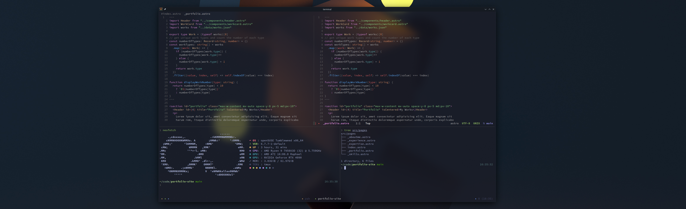

# **Sakuexe .dotfiles**

This repository includes all the configuration files that I use, as well as
guides for installing them. Recommendations and helpful suggestions are
always appreciated! :)

 

## Install Guides

Each folder in this repository contains a `README.md` file with a guide for
installing the configuration files in that folder.

### cloning the repository

```bash
git clone https://github.com/sakuexe/.dotfiles ~/.dotfiles
mv ~/.dotfiles/* ~/.config/
mv ~/.dotfiles/.* ~/.config/
```

### Zsh

[Zsh dotfiles](./zsh/) - Shell and file navigation (config this first)

### Neovim

[Neovim Config Files](./nvim/) - Editor of choice

### Tmux

[Tmux dotfiles](./tmux/) - Terminal multiplexing

## Some bugs

I try to remember updating this section with any bugs that I encounter.
With hopefully solutions to them as well. That being said, I do appreciate
any help with solving these issues, that I may not have found a solution to.

<details>
    <summary>Nerdfont V3 Graphical Glitches</summary>

    On some instances of WSL2, the nerdfonts are not rendered properly. This creates
    graphical glitches in the terminal. Microsoft has already fixed most of this issue,
    but if you are still experiencing some, make sure you update your terminal to the
    newest version. I use the Windows Terminal. The preview version is a good thing
    to try in a situation where you are experiencing graphical glitches.

</details>

## Miscellaneous

Here's a list of some of the other stuff I enjoy having downloaded on my terminal as well.

- [Nerdfont](https://www.nerdfonts.com/) - For icons and symbols

- [live-server](https://www.chiarulli.me/Neovim/20-live-server/) - For automatically refreshing
  the browser on reload

```bash
# install the npm package globally
npm install -g live-server
# live preview a folder
live-server some-directory/
# or a singular file
live-server some-file.html
```

- [git-credential-manager](https://github.com/git-ecosystem/git-credential-manager/blob/release/docs/install.md#tarball)

Download the latest [tarball](https://github.com/git-ecosystem/git-credential-manager/releases/latest)

```bash
tar -xvf <path-to-tarball> -C /usr/local/bin
git-credential-manager configure
git config --global credential.credentialStore cache
# will remember your credentials after next login
```

Uninstalling git-credential-manager

```bash
git-credential-manager unconfigure
rm $(command -v git-credential-manager)
```
